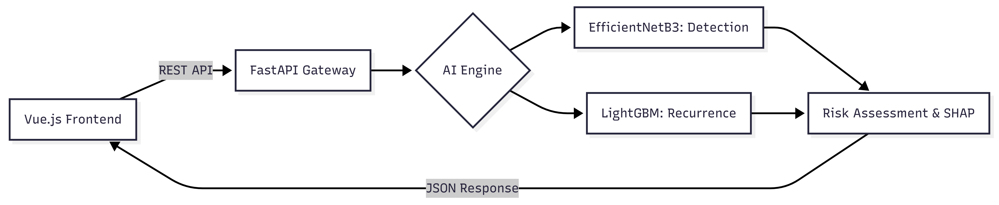

# AI-Based Oral Cancer Detection & Recurrence Prediction System
RV College of Engineering |Project 2025
An integrated clinical AI platform designed to assist medical professionals in the early diagnosis of oral lesions and the long-term risk management of cancer recurrence.

🎯 Project Overview
This system bridges the gap between raw medical data and actionable clinical insights through two specialized AI pipelines:

Malignancy Detection: Analyzes visual data from oral lesion images to identify high-probability cancerous growth.

Recurrence Prediction: Processes longitudinal clinical data from the SEER dataset to calculate the risk of cancer returning post-treatment.

🏗️ System Architecture
The application follows a modern decoupled architecture, ensuring scalability and ease of deployment:

Frontend: A responsive Vue.js dashboard featuring image upload capabilities, clinical form validation, and real-time visualization of SHAP explanations.

Backend: A FastAPI REST server that handles asynchronous requests, orchestrates model inference, and provides comprehensive Swagger documentation.

AI Engine: A dual-model approach utilizing MobileNetV2 for computer vision and LightGBM for tabular data classification.

🔬 Model Methodology
📸 Detection Pipeline (Computer Vision)
Model: MobileNetV2 (Pre-trained on ImageNet, fine-tuned on oral lesion datasets).

Input: 224x224 RGB images.

Performance: Achieved 87.3% accuracy through adaptive learning rates and early stopping.

🩺 Recurrence Pipeline (Tabular Data)
Model: LightGBM Classifier.

Dataset: SEER 2023 (Surveillance, Epidemiology, and End Results).

Features: 11 clinical indicators including age, tumor grade, primary site, and treatment history (Radiation/Chemotherapy).

Performance: 79.6% AUC, prioritized for high sensitivity to ensure clinical safety.

📁 Project Structure
/backend: Contains main.py (FastAPI logic), requirements.txt, and the models/ directory housing serialized weights and encoders.

/frontend: Contains the Vue.js source code, including type-safe API services and custom UI components for risk badges.

🚀 Quick Start
Backend Environment
Navigate to the backend directory, install dependencies via pip, and launch the server using uvicorn. The API documentation will be available at the /docs endpoint.

Frontend Environment
Navigate to the frontend directory, install packages via npm, and start the Vite development server to access the dashboard on localhost:5173.

🔒 Clinical Safety & Ethics
Decision Support Only: This platform is a research prototype and is not intended to replace professional medical diagnosis.

Stateless Processing: No Patient Health Information (PHI) is permanently stored; the system functions on a per-request inference basis.

Explainable AI: Uses SHAP values to provide "why" behind every prediction, fostering clinician trust.

👨‍🎓 Research Team
Department of Information Science and Engineering | RVCE

Prasanna A

Ravi R Naidu

Tentan M S

Yash Shah